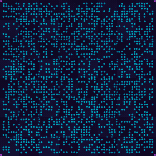
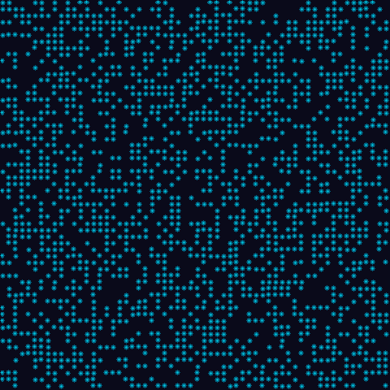
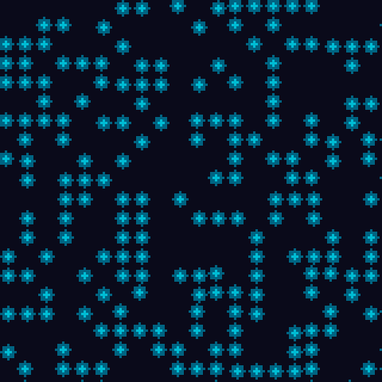

# Constellation ✨

**Data hidden in a starfield.**

[](https://github.com/nmn999999999/constellation/actions)
[](https://en.cppreference.com/w/cpp/17)
[](LICENSE)
[]()

> 把二进制数据藏进一片会动的星空 —— **无需任何密钥**，任何人拿到图片或视频帧，都能直接解码出隐藏的消息。



*↑ 连续无停顿的粒子动画：粒子在数据帧之间平滑流动（morph 过渡）。标记帧（4 角有紫色标记）可扫描，过渡帧由扫描器自动跳过。*

---

## 👀 这张图里藏着一句话



上图藏了 **1314 字节** 的消息。你肉眼看到的只是"一片星星"，但青色粒子的位置精确对应数据位 —— 解码器从图片中检测粒子、按固定种子逆向映射、通过 CRC 校验，即可还原原始数据。

**粒子特写**（每个粒子 = 一个数据位为 1 的网格单元）：



---

## 🚀 快速开始（30 秒）

```bash
# 编码：把一条消息编码为粒子帧
build/codec_demo encode "Hello, Constellation!"

# 解码：从图片中还原隐藏的消息
build/decode_image image.png 60 60
```

- **Windows**：从 [Releases](https://github.com/nmn999999999/constellation/releases) 下载免安装的单个 exe
- **从源码构建**：见下方 [Building](#building)

---

## ✨ 特性

- **无密钥编码** — 网格排列由固定种子确定性生成，任何拿到图的人都能解码（不依赖用户名/密钥）
- **看起来就是星空** — 青色粒子 + 辉光 + Perlin 噪声漂移，肉眼无法与随机星场区分
- **CRC32 帧校验** — 检测损坏/篡改
- **多帧支持** — 大文件自动分帧，带序号追踪
- **视频冗余** — 每数据帧渲染多帧动画，单帧损坏不影响恢复
- **Hamming ECC** — 可选单比特纠错，抗噪声信道
- **照片鲁棒性** — `GridCalibrator` 自动恢复旋转/缩放/平移，`HomographyCalibrator` 处理透视畸变
- **ML 辅助解码** — 内置 CNN 检测器（`decode_ml`），无需外部 ML 运行时
- **免 DLL 单文件** — MinGW 静态链接，Windows 上仅依赖系统 DLL

---

## 🧠 How It Works

1. **固定种子** — 从内置种子 + 域派生确定性种子（多轮哈希），生成网格置换。编码器与解码器使用相同的映射，因此无需用户名。
2. **帧结构** — 数据被分为若干帧：`[sync:4B][seq:2B][len:2B][payload][CRC32:4B]`，sync 字 `0xAA55AA55`。
3. **坐标编码** — 每个数据位映射到置换后的网格单元；位=1 的单元中心放置一个粒子。Perlin 噪声添加轻微运动，产生自然漂浮效果。
4. **解码** — 检测粒子（从图片或坐标列表），通过逆置换反向映射网格位置，重建原始字节并做 CRC 验证。
5. **纠错** — 可选 Hamming (7,4) 编码，每个 4-bit 块提供单比特纠错。

### 渲染参数（viewer 导出）

| 参数 | 值 |
|------|-----|
| 导出尺寸 | 480×480 |
| scale | 8 px/格（60 格） |
| 粒子半径 | 2 px（核心）+ 4 px 辉光 |
| 背景 | RGB(10,10,26) 深空蓝 |
| 粒子色 | 核心 RGB(0,188,212) / 辉光 RGB(0,100,130) |

### 照片与视频鲁棒性（实测，2026-08）

| 场景 | 结果 |
|------|------|
| 旋转 | 直接解码 ≤5°，校准后 ≤30° |
| 缩放 | 0.5 – 1.35× |
| 平移 | 画面内任意 |
| 透视 | `HomographyCalibrator`（8 个方向变体） |
| 高斯模糊 | 半径 ≤ 2.0 |
| 噪声 | σ ≤ 0.10 |
| JPEG | 低至 q10 |
| H.264 视频 | CRF ≤ 38 完整恢复 |
| VP9/AV1 极压 | ~60 KB / 3.8s 仍完整恢复 |

---

## 📁 Project Structure

```
├── include/particle_codec/      # Public headers
│   ├── codec.h
│   ├── error.h                  # ErrorCode / ErrorInfo / Result<T>
│   ├── grid_calibrator.h        # Affine grid calibration for photographs
│   ├── homography_calibrator.h  # Perspective (keystone) calibration
│   ├── frame_builder.h
│   ├── coordinate_encoder.h
│   ├── mapping_restorer.h
│   ├── frame_parser.h
│   ├── pseudo_random.h
│   ├── grid_mapping.h
│   ├── hamming.h
│   └── perlin_noise.h
├── src/                         # Implementations
├── demo/
│   ├── viewer.cpp               # Win32 GUI particle visualization (MSVC-only)
│   ├── decode_image.cpp         # CLI image decoder (stb_image)
│   └── decode_ml.cpp            # Hybrid ML decoder (CNN + GridCalibrator)
├── tests/                       # Unit + end-to-end + video-frame tests
├── train/                       # ML detector training (PyTorch)
└── docs/                        # Demo images
```

---

## 🧪 Tests

全部测试在 4 平台 CI（Linux GCC/Clang、macOS Clang、Windows MSVC）上通过：

```bash
build/codec_test.exe          # 15+ core unit tests
build/error_safety_test.exe   # validation & error-feedback tests
build/test_grid_calibrator.exe# geometry calibration (rotate/scale/shift)
build/test_homography.exe     # perspective calibration
build/test_decode_image.exe   # end-to-end encode/render/decode
build/test_viewer_decode.exe  # viewer-style roundtrip (104/104)
build/test_viewer_export.exe  # 480×480 export-style roundtrip
build/test_precision.exe      # precision benchmark
build/test_video_decode.exe   # video-frame decode + multi-frame fusion
```

---

## 🛠 Building

### Requirements

- C++17 compatible compiler (GCC 11+ / Clang 14+ / MSVC 2022)
- CMake 3.16+

```bash
cmake -S . -B build -G Ninja -DCMAKE_BUILD_TYPE=Release
cmake --build build
```

- **Linux/macOS**: `g++` / `clang++`
- **Windows**: MinGW（单文件免 DLL）或 MSVC

---

## 📚 Related Work

Constellation belongs to the "dot-pattern" family of visual data encoding:

- **Matrix codes (QR, Data Matrix, Aztec)** — closest mainstream relative: data encoded by presence/absence of cells on a fixed grid, decoded deterministically. Unlike Constellation they are explicit barcodes rather than a concealable visual medium.
- **Dot-pattern steganography research (DPCES)** — academic schemes map characters to randomized dot patterns, but without frame structure, CRC verification, or image-based blob decoding.
- **Point-cloud / 3D steganography** (e.g. [GS-Hider](https://github.com/xuanyuzhang21/GS-Hider), NeurIPS 2024) — hides messages in 3D Gaussian-splatting point clouds.
- **Mainstream image steganography** ([OpenStego](https://github.com/syvaidya/openstego), StegHide, [StegaStamp](https://github.com/tancik/StegaStamp)) — alter pixel values or learn a robust encoding; the carrier is a natural image rather than an aesthetic particle field.

What distinguishes Constellation: **the carrier *is* the message** — a deterministic, key-free particle field that anyone can decode from the image alone, with CRC32 frame verification and optional Hamming error correction.

---

## 📜 License

[MIT](LICENSE) — free to use, modify and distribute, including commercially; just keep the copyright notice.
